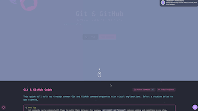

# Git-GitHub-Guide

An interactive Next.js website providing visual guides and tutorials for Git and GitHub, deployed on GitHub Pages.

## Demo

<!-- Add your GIF here -->
<div align="center">
  
</div>

## GitHub Pages Setup - IMPORTANT!

To properly enable GitHub Pages for this repository:

1. Go to your repository settings
2. Scroll down to the "Pages" section in the sidebar
3. Under "Build and deployment" > "Source", select "GitHub Actions" (NOT "Deploy from a branch")
4. Click "Save"
5. Wait for the GitHub Actions workflow to complete

## Features

- Interactive Git command visualizations
- Step-by-step tutorials
- Visual diagrams of Git workflows
- Responsive design with dark/light mode
- Animated Git operations

## Development

```bash
# Install dependencies
npm install

# Run development server locally
npm run dev

# View at http://localhost:3000/git-github-guide
# (matches the GitHub Pages path configuration)

# Build for production
npm run build

# Deploy to GitHub Pages
npm run deploy
```

## Deployment Methods

1. **GitHub Actions (Recommended)**: Push to main branch to trigger automatic deployment
2. **Manual Deployment**: Run `npm run deploy` to publish to the gh-pages branch

## Technologies

- Next.js 15
- React 19
- Tailwind CSS
- GitHub Pages for hosting
- Framer Motion for animations
- Radix UI components